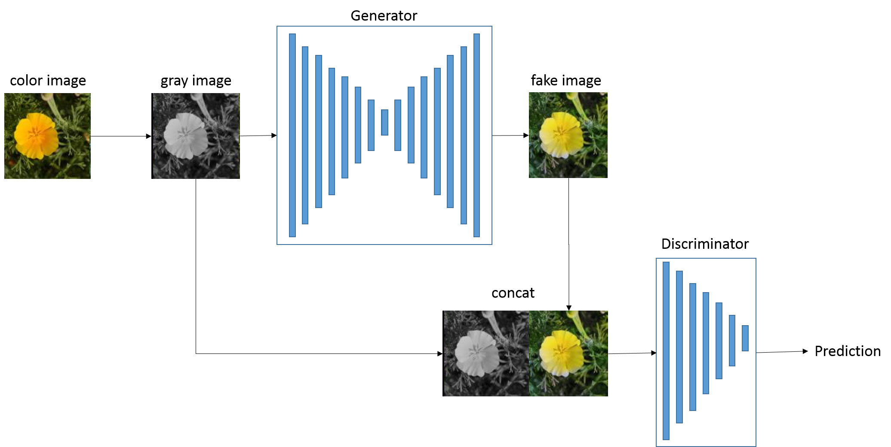
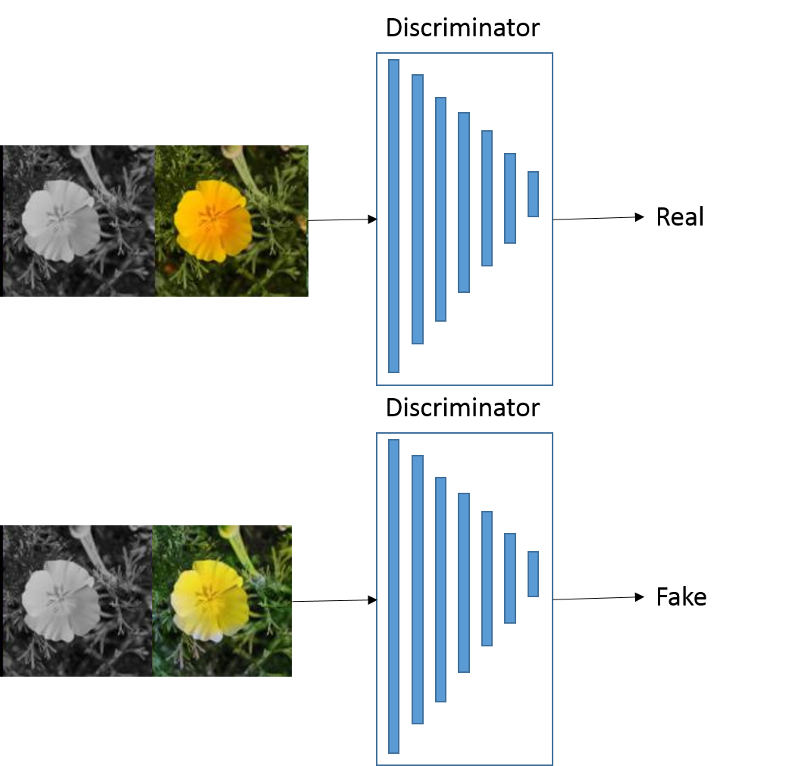
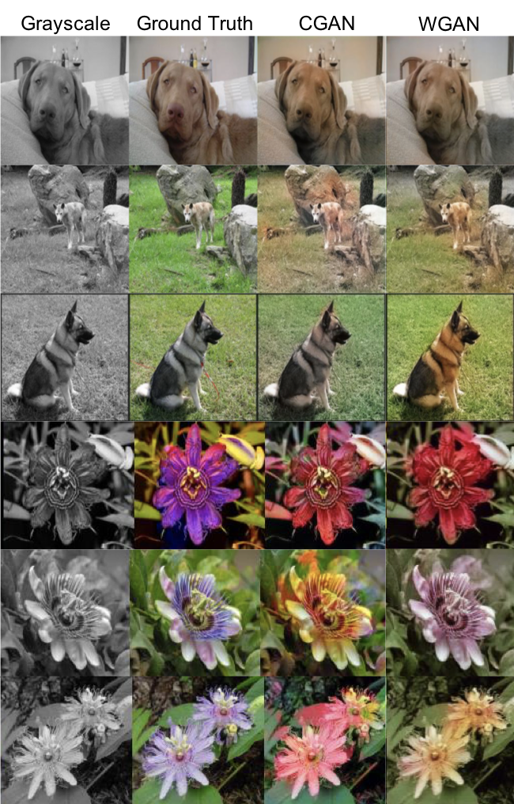
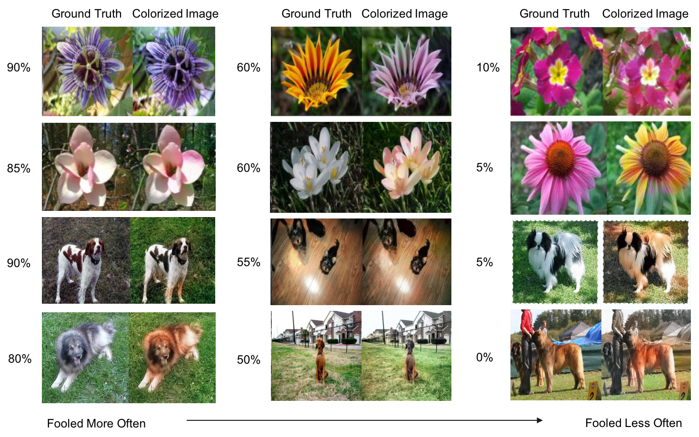

# Image Colorization with GANs 
In this project, we tried to approach the image colorization problem by using a conditional generative adversarial network (CGAN) and a Wasserstein generative adversarial network (WGAN). The networks were trained on two public datasets: [Stanford dogs dataset](http://vision.stanford.edu/aditya86/ImageNetDogs/) and [VGG flower dataset](http://www.robots.ox.ac.uk/~vgg/data/flowers/102/index.html). The colorized results of CGAN and WGAN are [shown here](#Results-Comparison-between-CGAN-and-WGAN). For the result evaluation of CGAN, We achieved a 42% perceptual realism in the [turing test](#Results-of-Perceptual-Realism).

## Prerequisites
- Python 3.6
- Google Computer Engine with NVIDIA GPU (V100, 200G memory)
- Linux
- Tensorflow 1.7
- CUDA 
- CUDNN

## Getting Started
### Installation
Clone the repo:
```bash
https://github.com/yxding/ImageColorization.git
cd ImageColorization
```

### Dataset
- [Stanford dogs dataset](http://vision.stanford.edu/aditya86/ImageNetDogs/)
- [VGG flower dataset](http://www.robots.ox.ac.uk/~vgg/data/flowers/102/index.html)
  
  After downloading the data, put them under the `data` folder.

### Training
- To train the model on dataset using CGAN:
```
python train.py 
```

## Network Design

### Conditional GAN
The network architecture is shown as follows:
<p align='center'>  
  
</p>

#### Generator
The generator is designed as a 16 layer U-Net architecture. The model is symmetric and it has skip connections between the symmetric layers. For the encoder, the kernel size is 4x4 with stride 2. For the decoder, the kernel size is 4x4 transposed layer with stride 2. The last layer is a 1x1 kernel layer with output channel number as 3. Each convolution layer is followed by batch normalization and ReLU activation function.
The input of the generator is a grayscale image and the output is a same size colored image.

#### Discriminator
The discriminator is a 7 layer convolutional neural network. Each layer has a 4x4 kernel with stride 2. Each convolution layer is followed by batch normalization and a ReLU activation function. The input of the discriminator is a grayscale image concated with a color image. The color image can be the ground truth image or the colorized image generated by the generated.
The output of the discriminator is whether the image is real or fake. Real meaning it is the ground truth image and fake meaning it is the generated image. An illustration is shown below:

<p align='center'>  
  
</p>

### Wasserstein GAN
Wasserstein GAN does not use JSD to measure divergence, instead it uses something called the Earth-Mover (EM) distance. The EM distance basically calculates the minimal cost of transforming one probability distribution into the other. WGAN is proved to have easier hyperparameter searching, improved stability, less mode collapse and theoretical optimization guarantees. 

For WGAN, we use the same architecture for the generator and discriminator as the previous CGAN, and modify the network by:
(1) After every gradient update on the critic function, clamp the weights to a small fixed range. 
(2) Use a new loss function derived from the Wasserstein distance, no logarithm anymore. 
(3) Switch the optimizer from Adam to RMSProp optimizer on the critic.

## Results Comparison between CGAN and WGAN
Figure below shows several colorized results of CGAN and WGAN. It is illustrated that WGAN can improve the results in some
cases, although the improvement is not very significant.
<p align='center'>  
  
</p>

## Results of Perceptual Realism
Based on the feedback from perceptual realism, it turns out that we can fool the participants by about 42%! Here are some examples from our survey and the number on the left of each picture shows the percentage of participants that recognized colorized image as the true one. The far left column shows example pairs that fool the participants most.
<p align='center'>  
  
</p>

## Authors

* **Yuxin Ding** 
* **Wen Xu** 

